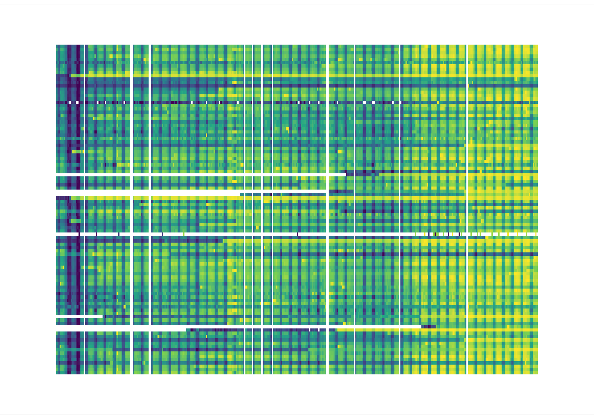
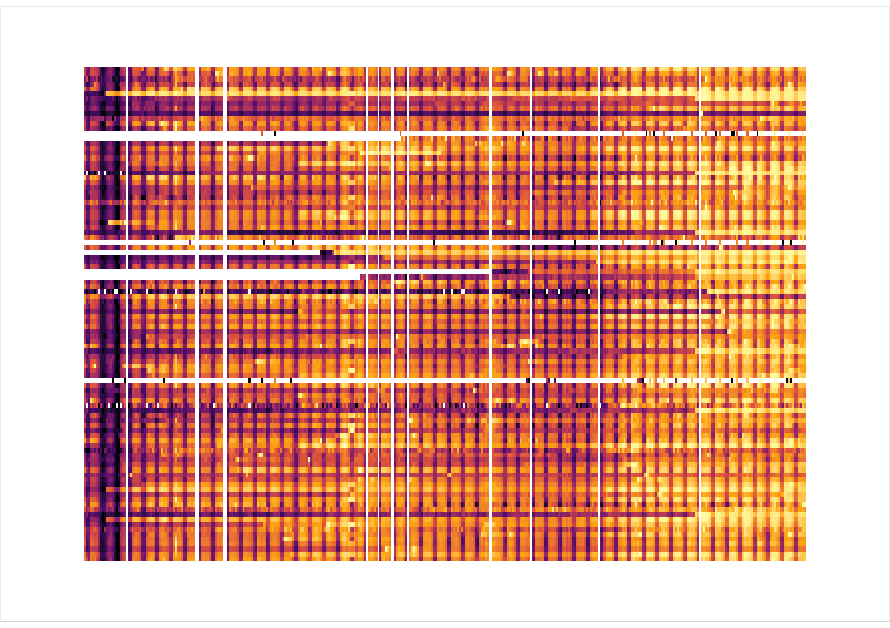
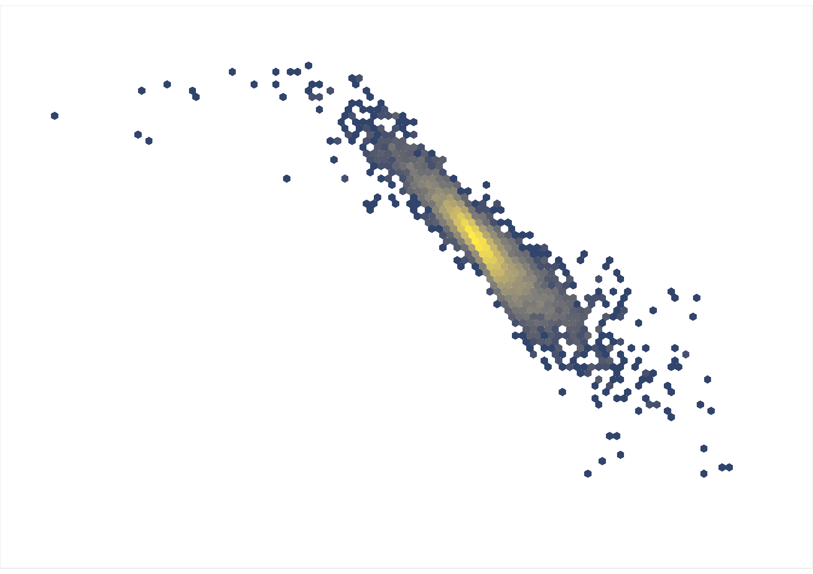
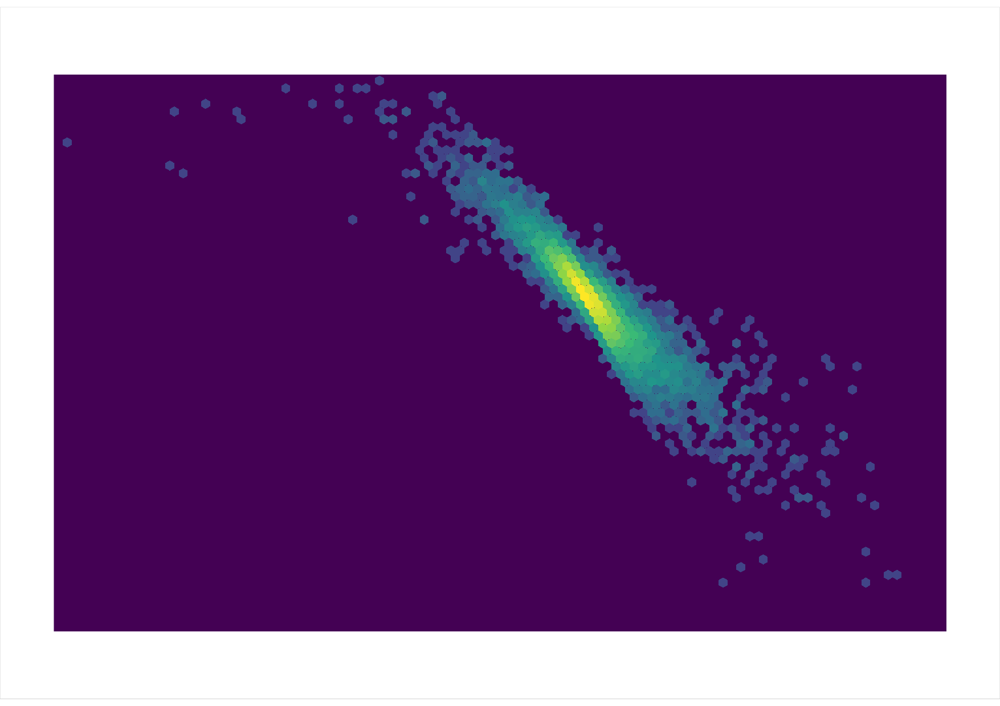
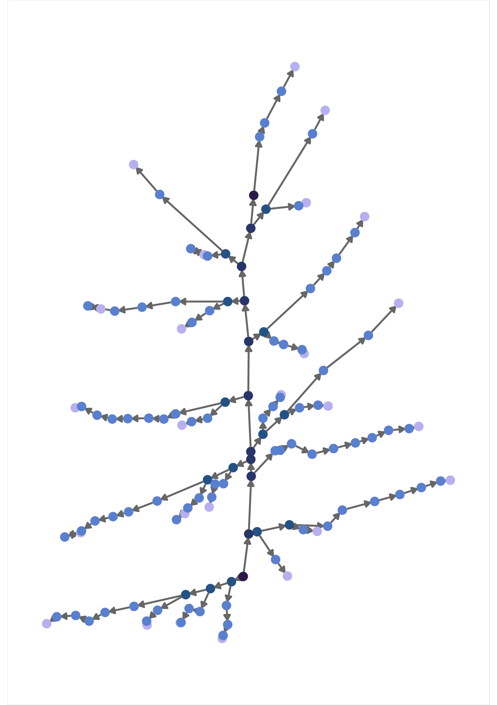
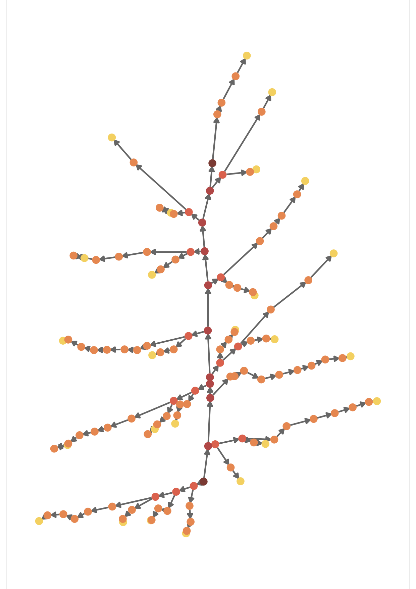

+++
# Project title.
title = "Postcards"

# Date this page was created.
date = 2017-08-01

# Project summary to display on homepage.
summary = "Some graph in R turned postcards. If you like them, feel free to print them and give them as a gift. :)"

# Tags: can be used for filtering projects.
# Example: `tags = ["fun", "accidental art"]`

# Optional external URL for project (replaces project detail page).
# external_link = ""

# Featured image
# To use, add an image named `featured.jpg/png` to your project's folder.
[image]
  # Caption (optional)
  caption = ""

  # Focal point (optional)
  # Options: Smart, Center, TopLeft, Top, TopRight, Left, Right, BottomLeft, Bottom, BottomRight
  focal_point = "Smart"
+++

During the year I turned some plot that I like into postcards. If you like them, feel free to print them and give them as a gift.

The [source code is here](https://github.com/othomantegazza/christmas-cards).

# Tartan

AKA: R packages downloaded from CRAN.

In green:

And in red:

# Galaxy

AKA: Gene Expression Correlation.

In white:

And in blue:

# Christmas Tree

AKA: A rice panicle.

In blue:

And in red:

